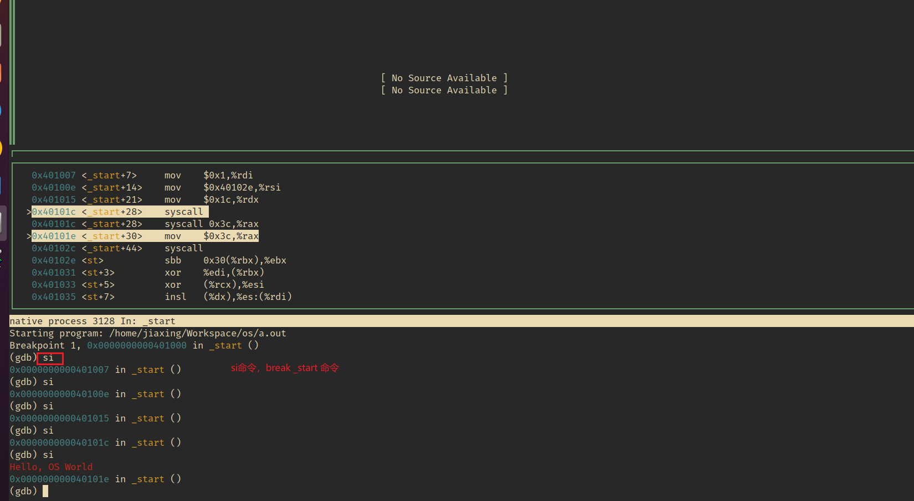

# 最小的汇编程序——输出hello world

1. 汇编程序输出hello world

2. 不需要链接到任何其他库

```asm
.globl _start
_start:
  movq $SYS_write, %rax   // write(
  movq $1,         %rdi   //   fd=1,
  movq $st,        %rsi   //   buf=st,
  movq $(ed - st), %rdx   //   count=ed-st
  syscall                 // );

  movq $SYS_exit,  %rax   // exit(
  movq $1,         %rdi   //   status=1
  syscall                 // );

st:
  .ascii "\033[01;31mHello, OS World\033[0m\n"
ed:
```

> 运行：
> 
> $ gcc -c minimal.S
> 
> $ ld minimal.o
> 
> $ a.out

## 代码解释：

| 指令                    | 功能                             |
| --------------------- | ------------------------------ |
| `mov $1, %rax`        | rax是通用寄存器，设置系统调用号为 `sys_write` |
| `mov $1, %rdi`        | 指定文件描述符为标准输出                   |
| `lea msg(%rip), %rsi` | 加载字符串地址                        |
| `mov $14, %rdx`       | 设置输出字符串的长度                     |
| `syscall`             | 发起系统调用                         |
| `mov $60, %rax`       | 设置系统调用号为 `sys_exit`            |
| `xor %rdi, %rdi`      | 设置退出码为 0                       |

## 使用gdb调试

#### gdb调试时有多种layout

| 布局模式        | 说明                                                |
| ----------- | ------------------------------------------------- |
| **`src`**   | 显示源码窗口，展示当前调试的源代码。                                |
| **`asm`**   | 显示汇编窗口，展示程序对应的汇编指令。                               |
| **`split`** | 同时显示源码窗口和汇编窗口。                                    |
| **`regs`**  | 显示寄存器窗口。                                          |
| **`next`**  | 切换到下一个布局模式（依次循环 src → asm → split → regs → none）。 |
| **`none`**  | 退出 TUI 模式，返回普通的 GDB 命令行界面。                        |

我们这里使用layout split


