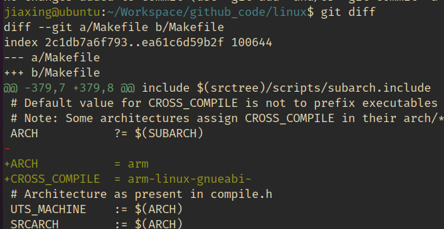
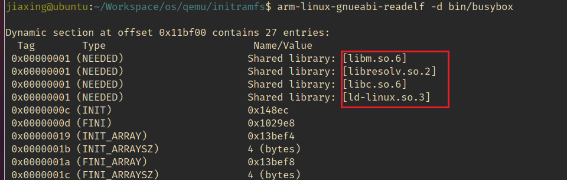

# 使用qemu启动a9开发板

## 安装qemu

> sudo apt intall qemu

## 安装交叉编译环境

arm-linux-gnueabi-

## linux源码下载

直接修改顶层Makefile



可以不需要手动改Makefile，直接从外部Make时传递进去

> make ARCH=arm CROSS_COMPILE=arm-linux-gnueabi- defconfig
> make ARCH=arm CROSS_COMPILE=arm-linux-gnueabi- menuconfig
> 
> // menuconfig中确保打开了ramfs相关的支持项
> 
> make ARCH=arm CROSS_COMPILE=arm-linux-gnueabi- -j$(nproc)


## 启动

### 需要的东西

1. zImage，前面Linux内核生成的内核镜像，a9生成的在 ./arch/arm/boot/zImage

2. dtb（设备树文件），也跟着前面一起生成了，./arch/arm/boot/dts/arm/vexpress-v2p-ca9.dtb

3. 文件系统
   
   1. 可以是根文件系统（rootfs）
   
   2. 也可以用initramfs
   
   3. 都是使用busybox来提供工具包

4. qemu，qemu-system-arm、qemu-system-riscv都行

ARM架构启动一般是这样：

```bash
qemu-system-arm -M virt \
  -kernel zImage \
  -dtb virt.dtb \
  -append "console=ttyAMA0 root=/dev/vda" \
  -hda rootfs.img \
  -nographic
```

### 创建initramfs

#### 创建initramfs文件系统

> mkdir -p initramfs/{bin,sbin,etc,proc,sys,usr/{bin,sbin},dev}

#### 创建init脚本

这是必须的，initramfs依赖init脚本

创建 initramfs/init文件，内容可以参考下面：

```bash
#!/bin/sh
echo "Booting into initramfs..."
mount -t proc none /proc
mount -t sysfs none /sys
exec /bin/sh
```

chmod +x initramfs/init 添加可执行权限

#### 下载并编译busybox

```bash
wget https://busybox.net/downloads/busybox-1.36.0.tar.bz2
tar -xf busybox-1.36.0.tar.bz2
cd busybox-1.36.0
make ARCH=arm CROSS_COMPILE=arm-linux-gnueabi- defconfig
make ARCH=arm CROSS_COMPILE=arm-linux-gnueabi- -j$(nproc)
make ARCH=arm CROSS_COMPILE=arm-linux-gnueabi- install CONFIG_PREFIX=../initramfs
```

#### 打包initramfs，生成对应的镜像文件

```bash
cd initramfs
find . | cpio -o --format=newc | gzip > ../initramfs.cpio.gz
cd ..

```

### 启动测试

```bash
qemu-system-arm   -M vexpress-a9   -kernel arch/arm/boot/zImage   -dtb arch/arm/boot/dts/arm/vexpress-v2p-ca9.dtb   -initrd ~/Workspace/os/qemu/initramfs.cpio.gz   -append "console=ttyAMA0 init=/init debug"   -nographic
```

### 问题记录

一直启动失败，由于busybox是动态链接的，依赖一些so，通过readelf查看



copy依赖的so

```bash
/usr/arm-linux-gnueabi/lib$ cp libm.so.6 ~/Workspace/os/qemu/initramfs/lib/
```

启动成功了


