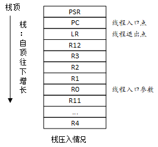
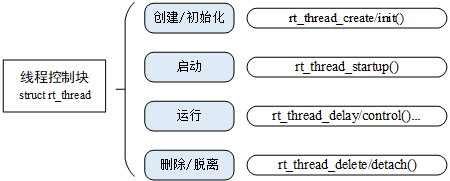

# 线程管理

## 线程管理功能特点

Rt-thread主要是对线程进行管理和调度，包括系统线程和用户线程

* 系统线程：由rtthread内核创建的线程

* 用户线程：由应用程序创建的线程

Rt-thread线程调度器特点：

* 抢占式

* 从线程就绪列表中，找出优先级最高的线程

* 当调度器线程切换时，先把当前线程上下文保存，再切回当前进程，恢复该线程的上下文恢复

## 线程属性

### 线程栈

RT-Thread 线程具有独立的栈，当进行线程切换时，会将当前线程的上下文存在栈中，当线程要恢复运行时，再从栈中读取上下文信息，进行恢复。

对于线程第一次运行，可以以手工的方式构造这个上下文来设置一些初始的环境：**入口函数（PC 寄存器）、入口参数（R0 寄存器）、返回位置（LR 寄存器）、当前机器运行状态（CPSR 寄存器）**



### 线程优先级

RT-Thread 最大支持 256 个线程优先级 (0~255) `数值越小的优先级越高，0 为最高优先级`。

* 最低优先级默认分配给空闲线程使用，用户一般不使用

* 在系统中，当有比当前线程优先级更高的线程就绪时，当前线程将立刻被换出，高优先级线程抢占处理器运行

## 线程管理方式

线程相关操作



有两种线程：动态线程和静态线程

* **动态线程：** 系统自动从动态内存堆上分配栈空间与线程句柄（初始化 heap 之后才能使用 create 创建动态线程）
  
  * 使用rt_thread_create接口创建
  * 使用rt_thread_delete接口删除，使用rt_thread_delete时需要注意
    * 如果线程处于**就绪态、未运行**时：会立即退出，因为此时线程还未获取到CPU，不影响系统，直接删除
  * 阻塞、挂起状态：类似于在等信号量、消息队列，不会执行后续代码，直接删除
    * **运行状态**：`不会立即退出，只会把任务标记为close状态，需要等待下次任务调度时，才会删除`
  
* **静态线程：** 由用户分配栈空间与线程句柄
  
  * 使用rt_thread_init接口初始化
  
  * 对于用 rt_thread_init() 初始化的线程，使用 rt_thread_detach() 将使线程对象在线程队列和内核对象管理器中被脱离

## 测试代码

* 用rt_thread_create 创建动态线程thread1

* 用rt_thread_init 创建静态线程thread2

* 过1s之后，使用rt_thread_delete接口删除动态线程thread1

```c
#include <rtthread.h>

#define THREAD_PRIORITY         25
#define THREAD_STACK_SIZE       512
#define THREAD_TIMESLICE        5

static rt_thread_t tid1 = RT_NULL;

/* 线程 1 的入口函数 */
static void thread1_entry(void *parameter)
{
    rt_uint32_t count = 0;

    while (1)
    {
        /* 线程 1 采用低优先级运行，一直打印计数值 */
        rt_kprintf("thread1 count: %d\n", count ++);
        rt_thread_mdelay(500);
    }
}

ALIGN(RT_ALIGN_SIZE)
static char thread2_stack[1024];
static struct rt_thread thread2;
/* 线程 2 入口 */
static void thread2_entry(void *param)
{
    rt_uint32_t count = 0;

    /* 线程 2 拥有较高的优先级，以抢占线程 1 而获得执行 */
    for (count = 0; count < 10 ; count++)
    {
        /* 线程 2 打印计数值 */
        rt_kprintf("thread2 count: %d\n", count);
    }
    rt_kprintf("thread2 exit\n");
    /* 线程 2 运行结束后也将自动被系统脱离 */
}

/* 线程示例 */
int thread_sample(void)
{
    /* 创建线程 1，名称是 thread1，入口是 thread1_entry*/
    tid1 = rt_thread_create("thread1",
                            thread1_entry, RT_NULL,
                            THREAD_STACK_SIZE,
                            THREAD_PRIORITY, THREAD_TIMESLICE);

    /* 如果获得线程控制块，启动这个线程 */
    if (tid1 != RT_NULL)
        rt_thread_startup(tid1);

    /* 初始化线程 2，名称是 thread2，入口是 thread2_entry */
    rt_thread_init(&thread2,
                   "thread2",
                   thread2_entry,
                   RT_NULL,
                   &thread2_stack[0],
                   sizeof(thread2_stack),
                   THREAD_PRIORITY - 1, THREAD_TIMESLICE);
    rt_thread_startup(&thread2);

    rt_kprintf("main thread waiting ...\n");
    rt_thread_mdelay(1000);
    rt_thread_delete(tid1);


    return 0;
}

/* 导出到 msh 命令列表中 */
MSH_CMD_EXPORT(thread_sample, thread sample);
```

测试结果：

```bash
$ ./qemu.sh 
QEMU emulator version 6.2.0 (Debian 1:6.2+dfsg-2ubuntu6.24)
Copyright (c) 2003-2021 Fabrice Bellard and the QEMU Project developers
WARNING: Image format was not specified for 'sd.bin' and probing guessed raw.
         Automatically detecting the format is dangerous for raw images, write operations on block 0 will be restricted.
         Specify the 'raw' format explicitly to remove the restrictions.
pulseaudio: set_sink_input_volume() failed
pulseaudio: Reason: Invalid argument
pulseaudio: set_sink_input_mute() failed
pulseaudio: Reason: Invalid argument

 \ | /
- RT -     Thread Operating System
 / | \     5.2.0 build Mar 10 2025 10:40:19
 2006 - 2024 Copyright by RT-Thread team
[I/SDIO] SD card capacity 65536 KB.
[I/SDIO] sd: switch to High Speed / SDR25 mode 

[I/FileSystem] file system initialization done!

Hello RT-Thread!
msh />thread_sample
main thread waiting ...
thread2 count: 0
thread2 count: 1
thread2 count: 2
thread2 count: 3
thread2 count: 4
thread2 count: 5
thread2 count: 6
thread2 count: 7
thread2 count: 8
thread2 count: 9
thread2 exit
thread1 count: 0
thread1 count: 1
```


